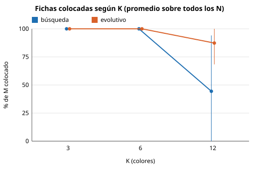
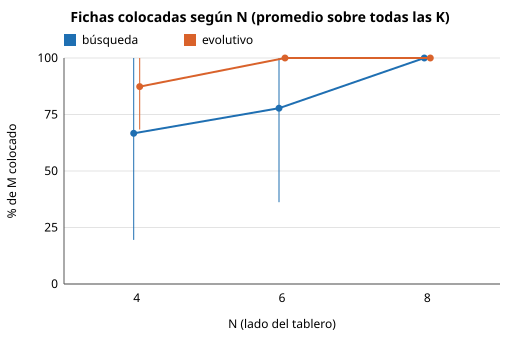
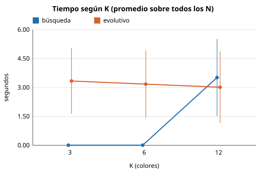
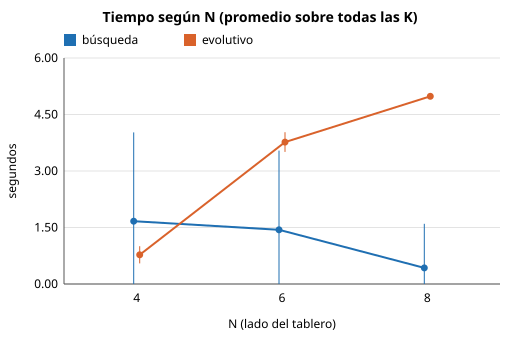

# Informe: agentes de búsqueda y evolutivo para TileUp

## 1. Problema

TileUp es un problema determinista y completamente observable: la secuencia de M fichas se conoce desde el inicio y no hay azar durante la partida. En cada paso se coloca la ficha actual en una celda vacía del tablero N × N; si queda adyacente ortogonalmente a fichas de su color, la componente se fusiona en una sola ficha con la suma de los valores. La fusión conserva el valor total del tablero, por lo que las decisiones solo afectan cuántas celdas quedan ocupadas.

El orden de calidad de una solución es el del concurso: primero más fichas colocadas y, ante empate, menos celdas ocupadas al terminar.

## 2. Agente de búsqueda

*Pendiente.*

## 3. Agente evolutivo

Implementación: `evolutionary_agent.py`. Ejecución: `python main.py solve --agent evo`.

### 3.1 Representación del individuo

Se usa una representación indirecta. Un individuo es un vector de seis pesos reales en [-10, 10], uno por característica. El individuo define una política: en cada turno se calcula, para cada celda vacía, el puntaje `Σ pesoᵢ · característicaᵢ`, y la ficha se coloca en la celda de mayor puntaje. Los empates se resuelven por orden fila-mayor.

| Característica | Definición |
| --- | --- |
| `absorbe` | Fichas del mismo color adyacentes a la celda; coincide con \|G\| − 1. |
| `vecinos_otro` | Vecinos ocupados por fichas de otro color. |
| `vecinos_vacios` | Vecinos vacíos. |
| `borde` | Lados de la celda sobre el borde del tablero (0, 1 o 2). |
| `reserva` | Vecinos vacíos, solo si la colocación no fusiona y el color de la ficha aparece en la ventana de anticipación. |
| `bloqueo` | Vecinos de otro color cuyo color aparece en la ventana de anticipación. |

La ventana de anticipación son las siguientes `lookahead` fichas de la secuencia (4 por defecto). Usarla es válido porque la secuencia es conocida de antemano.

Esta representación se eligió frente a codificar directamente la celda de cada ficha por tres razones:

1. Toda partida generada es legal, sin operadores de reparación.
2. La longitud del individuo es independiente de N y de M.
3. El cruce combina estilos de juego en lugar de jugadas cuyo significado depende de todas las anteriores, lo que daría una baja localidad.

El costo es que la calidad alcanzable queda acotada por la expresividad de las características.

### 3.2 Función de aptitud

`aptitud = colocadas · (N² + 1) − ocupadas`

Como las celdas ocupadas nunca superan N², una ficha colocada adicional siempre supera cualquier diferencia de ocupación. La aptitud ordena las partidas igual que el concurso. Evaluar un individuo equivale a simular la partida completa con su política.

### 3.3 Selección

Torneo de tamaño 3: se eligen tres individuos al azar y el de mayor aptitud es padre. Da ventaja a los mejores sin eliminar a los demás, lo que mantiene diversidad, y no depende de la escala de la aptitud.

### 3.4 Operadores de variación

- **Cruce uniforme** con probabilidad 0.9: cada peso del hijo se toma de uno de los dos padres con probabilidad 1/2. Si no hay cruce, el hijo es copia del primer padre.
- **Mutación gaussiana**: cada peso, con probabilidad 0.3, recibe ruido N(0, 1.5²) y se recorta a [-10, 10]. Acotar los pesos no reduce la expresividad, porque la política solo depende del orden relativo de los puntajes.

### 3.5 Política de reemplazo

Generacional con elitismo: los 2 mejores individuos pasan intactos y el resto de la población se reemplaza por hijos. La mejor aptitud no decrece entre generaciones.

La población inicial contiene el vector de referencia `(10, −2, 0.5, 0.5, 1, −1.5)`, que prioriza la fusión, más individuos uniformes en [-10, 10]. Esto garantiza un punto de partida razonable y que siempre exista una solución que entregar.

### 3.6 Criterio de paro

Se detiene ante lo primero que ocurra:

- 100 generaciones;
- 25 generaciones sin mejorar la mejor aptitud;
- alcanzar el óptimo (todas las fichas colocadas con una sola celda ocupada);
- el límite de tiempo.

Una evaluación nueva solo empieza si la más lenta observada cabe en el tiempo restante, de modo que la ejecución no rebasa el límite.

### 3.7 Determinismo y medida de esfuerzo

Todo el azar proviene de un único `random.Random(semilla)`, y la política es determinista. Con la misma semilla, la secuencia de individuos es idéntica. Los paros por generaciones, estancamiento u óptimo son por tanto reproducibles. Si el paro lo provoca el reloj, el resultado depende de cuántas generaciones alcanzó a completar la máquina; en las instancias de ajuste ninguna ejecución llegó a ese caso.

La medida de esfuerzo es el número de evaluaciones de aptitud (partidas simuladas distintas). Los individuos repetidos, como los élites, se resuelven con caché y no se cuentan.

### 3.8 Parámetros y procedimiento de ajuste

| Parámetro | Valor | Opción de `solve` |
| --- | --- | --- |
| Tamaño de población | 30 | `--population` |
| Tamaño de torneo | 3 | `--tournament` |
| Probabilidad de cruce | 0.9 | `--crossover-rate` |
| Probabilidad de mutación por peso | 0.3 | `--mutation-rate` |
| Desviación de la mutación | 1.5 | `--mutation-sigma` |
| Élites | 2 | `--elite` |
| Máximo de generaciones | 100 | `--generations` |
| Generaciones sin mejora | 25 | `--stall` |
| Ventana de anticipación | 4 | `--lookahead` |

**Procedimiento.** Los valores base se fijaron a priori con criterios usuales: población moderada, torneo pequeño, cruce frecuente y mutación de alcance medio. Luego se validaron con un barrido de un factor a la vez (`experiments/tune_evo.py`): cada parámetro se varió a un valor menor y a uno mayor, manteniendo los demás en su valor base.

Cada variante se ejecutó sobre cuatro instancias de ajuste con las semillas 1, 2 y 3 y un límite de 5 s. Las instancias de ajuste se generan con semillas propias y son distintas de las de la comparación experimental, para no ajustar sobre los datos de evaluación. Las variantes se ordenan por rango promedio entre instancias, según la aptitud media; los empates reciben el promedio de sus posiciones.

Los datos completos están en `experiments/results/tuning.csv` y el resumen en `experiments/results/tuning_summary.md`:

Celdas por instancia: colocadas / ocupadas, media ± desviación estándar entre semillas.

| Variante | Rango promedio | N4_K10_M100 | N5_K12_M150 | N5_K20_M150 | N6_K15_M300 | Evaluaciones | Tiempo (s) |
| --- | --- | --- | --- | --- | --- | --- | --- |
| stall_generations=50 | 4.75 | 88.0 ± 8.8 / 14.7 ± 1.9 | 150.0 ± 0.0 / 12.0 ± 0.0 | 56.0 ± 0.8 / 25.0 ± 0.0 | 300.0 ± 0.0 / 15.0 ± 0.0 | 1724 | 1.92 |
| base | 5.00 | 86.0 ± 9.9 / 14.7 ± 1.9 | 150.0 ± 0.0 / 12.0 ± 0.0 | 56.0 ± 0.8 / 25.0 ± 0.0 | 300.0 ± 0.0 / 15.0 ± 0.0 | 1000 | 0.98 |
| tournament_size=2 | 5.25 | 82.7 ± 3.3 / 16.0 ± 0.0 | 150.0 ± 0.0 / 12.0 ± 0.0 | 56.0 ± 0.8 / 25.0 ± 0.0 | 300.0 ± 0.0 / 15.0 ± 0.0 | 999 | 0.93 |
| population_size=15 | 6.00 | 80.3 ± 2.6 / 16.0 ± 0.0 | 150.0 ± 0.0 / 12.0 ± 0.0 | 56.0 ± 0.8 / 25.0 ± 0.0 | 300.0 ± 0.0 / 15.0 ± 0.0 | 399 | 0.44 |
| lookahead=8 | 6.25 | 77.7 ± 8.1 / 16.0 ± 0.0 | 150.0 ± 0.0 / 12.0 ± 0.0 | 61.0 ± 1.4 / 25.0 ± 0.0 | 300.0 ± 0.0 / 15.0 ± 0.0 | 934 | 0.97 |
| mutation_sigma=3.0 | 6.75 | 81.0 ± 3.6 / 16.0 ± 0.0 | 150.0 ± 0.0 / 12.0 ± 0.0 | 55.0 ± 0.8 / 25.0 ± 0.0 | 300.0 ± 0.0 / 15.0 ± 0.0 | 851 | 0.87 |
| stall_generations=10 | 7.25 | 73.0 ± 7.8 / 16.0 ± 0.0 | 150.0 ± 0.0 / 12.0 ± 0.0 | 56.0 ± 0.8 / 25.0 ± 0.0 | 300.0 ± 0.0 / 15.0 ± 0.0 | 430 | 0.44 |
| tournament_size=5 | 7.38 | 78.7 ± 0.5 / 16.0 ± 0.0 | 150.0 ± 0.0 / 12.0 ± 0.0 | 55.3 ± 0.5 / 25.0 ± 0.0 | 300.0 ± 0.0 / 15.0 ± 0.0 | 841 | 0.95 |
| mutation_rate=0.1 | 7.62 | 81.0 ± 3.6 / 16.0 ± 0.0 | 150.0 ± 0.0 / 12.0 ± 0.0 | 52.7 ± 0.9 / 25.0 ± 0.0 | 300.0 ± 0.0 / 15.0 ± 0.0 | 703 | 0.81 |
| mutation_rate=0.5 | 7.75 | 79.0 ± 0.0 / 16.0 ± 0.0 | 150.0 ± 0.0 / 12.0 ± 0.0 | 54.7 ± 0.5 / 25.0 ± 0.0 | 300.0 ± 0.0 / 15.0 ± 0.0 | 923 | 0.90 |
| population_size=50 | 8.38 | 78.7 ± 0.5 / 16.0 ± 0.0 | 150.0 ± 0.0 / 12.0 ± 0.0 | 54.3 ± 0.5 / 25.0 ± 0.0 | 300.0 ± 0.0 / 15.0 ± 0.0 | 1569 | 1.61 |
| mutation_sigma=0.5 | 8.62 | 72.7 ± 7.5 / 16.0 ± 0.0 | 150.0 ± 0.0 / 12.0 ± 0.0 | 55.0 ± 0.8 / 25.0 ± 0.0 | 300.0 ± 0.0 / 15.0 ± 0.0 | 835 | 1.04 |
| lookahead=0 | 10.00 | 52.0 ± 0.0 / 16.0 ± 0.0 | 150.0 ± 0.0 / 12.0 ± 0.0 | 50.0 ± 0.0 / 25.0 ± 0.0 | 300.0 ± 0.0 / 15.0 ± 0.0 | 748 | 0.84 |

**Lectura.**

- **La ventana de anticipación es el factor dominante.** Sin ella (`lookahead=0`), el agente coloca entre 6 y 34 fichas menos que la base en las instancias que terminan en derrota y obtiene el peor rango. Ampliarla a 8 mejora la instancia de 20 colores (61 contra 56 fichas), pero empeora la de 10 colores. El valor 4 es el compromiso.
- **Los parámetros del operador evolutivo tienen efecto pequeño**, frente a la dispersión entre semillas. La configuración base queda segunda, a 0.25 de rango de `stall_generations=50`, que mejora ligeramente una instancia a cambio de casi el doble de evaluaciones. Se conserva la base. Para el concurso, donde el tiempo es solo el tercer criterio, puede usarse `--stall 50`.
- **Las instancias N5_K12 y N6_K15 dieron el mismo resultado con todas las variantes**, así que no discriminan entre configuraciones. La decisión descansa en las otras dos.
- **Casi todas las ejecuciones terminan por estancamiento antes de agotar el tiempo.** Con una política determinista por argmax, muchos vectores de pesos producen exactamente la misma partida, y el paisaje de aptitud tiene mesetas amplias.

**Limitaciones del ajuste.** El barrido de un factor a la vez no captura interacciones entre parámetros, y el conjunto de ajuste es pequeño. Una mejora natural sería reiniciar la población al estancarse, para aprovechar el tiempo restante.

## 4. Comparación experimental

> **Resultados preliminares.** El agente de búsqueda tiene correcciones pendientes (entregar la mejor solución parcial al agotar el tiempo y eliminar la recursión). Cuando se integren hay que volver a correr `python experiments/run_comparison.py` y actualizar esta sección.

**Diseño.**

- Seis configuraciones de N, K y M (`experiments/run_comparison.py`), desde instancias holgadas hasta instancias donde el tablero se llena; la última tiene una secuencia de 1200 fichas.
- Tres semillas por configuración. Para cada semilla se genera una instancia distinta con `generate.py`, y la misma semilla se pasa al agente. La dispersión refleja la variación entre instancias de la misma configuración y el azar del agente evolutivo; la búsqueda es determinista.
- Límite de 10 s por ejecución para ambos agentes.
- Cada ejecución invoca `python main.py solve` como proceso aparte y su solución se verifica con `validator.py`.

Las instancias, las soluciones y los resultados por ejecución están en `experiments/comparison/`.

Límite de tiempo: 10.0 s por ejecución. Semillas: 1, 2, 3.
Valores: media ± desviación estándar entre semillas, sobre las ejecuciones que terminaron.

| Configuración | Agente | Terminadas | Legales | Colocadas | Ocupadas | Tiempo (s) | Esfuerzo | Detalle |
| --- | --- | --- | --- | --- | --- | --- | --- | --- |
| C1_N4_K3_M40 | search | 3/3 | 3/3 | 40.0 ± 0.0 de 40 | 3.3 ± 0.5 | 0.00 ± 0.00 | 41 ± 0 nodos | victory |
| C1_N4_K3_M40 | evo | 3/3 | 3/3 | 40.0 ± 0.0 de 40 | 3.0 ± 0.0 | 0.51 ± 0.04 | 714 ± 2 evaluaciones | estancamiento |
| C2_N5_K5_M100 | search | 3/3 | 3/3 | 100.0 ± 0.0 de 100 | 6.0 ± 0.8 | 0.00 ± 0.00 | 101 ± 0 nodos | victory |
| C2_N5_K5_M100 | evo | 3/3 | 3/3 | 100.0 ± 0.0 de 100 | 5.0 ± 0.0 | 1.54 ± 0.04 | 713 ± 4 evaluaciones | estancamiento |
| C3_N6_K8_M200 | search | 3/3 | 3/3 | 200.0 ± 0.0 de 200 | 21.0 ± 5.4 | 0.00 ± 0.00 | 201 ± 0 nodos | victory |
| C3_N6_K8_M200 | evo | 3/3 | 3/3 | 200.0 ± 0.0 de 200 | 8.0 ± 0.0 | 3.85 ± 0.08 | 712 ± 4 evaluaciones | estancamiento |
| C4_N5_K15_M150 | search | 3/3 | 3/3 | 0.0 ± 0.0 de 150 | 0.0 ± 0.0 | 10.03 ± 0.02 | 1296091 ± 16015 nodos | timeout |
| C4_N5_K15_M150 | evo | 3/3 | 3/3 | 150.0 ± 0.0 de 150 | 17.3 ± 1.9 | 1.93 ± 0.62 | 1198 ± 314 evaluaciones | estancamiento |
| C5_N8_K6_M400 | search | 3/3 | 3/3 | 400.0 ± 0.0 de 400 | 10.3 ± 0.5 | 0.02 ± 0.00 | 401 ± 0 nodos | victory |
| C5_N8_K6_M400 | evo | 3/3 | 3/3 | 400.0 ± 0.0 de 400 | 6.0 ± 0.0 | 9.98 ± 0.01 | 503 ± 11 evaluaciones | tiempo |
| C6_N10_K4_M1200 | search | 0/3 | 0/0 | n/d de 1200 | n/d | n/d | n/d  | RecursionError: maximum recursion depth exceeded |
| C6_N10_K4_M1200 | evo | 3/3 | 3/3 | 1200.0 ± 0.0 de 1200 | 4.0 ± 0.0 | 9.93 ± 0.04 | 139 ± 2 evaluaciones | tiempo |

**Lectura preliminar.**

- **Ambos agentes producen solo soluciones legales**, en todas las ejecuciones que terminaron.
- **En las instancias holgadas (C1, C2, C3, C5) ambos colocan todas las fichas.** La búsqueda lo logra en milisegundos, porque su orden de movimientos (fusionar primero) encuentra una victoria sin retroceder. El evolutivo deja siempre el tablero más despejado: en C3, 8 celdas contra 21 ± 5.4. La búsqueda se detiene en la primera victoria y no optimiza el segundo criterio.
- **En C4 (15 colores en un tablero 5×5) la búsqueda agota el tiempo**, tras más de 1.2 millones de nodos, y entrega una solución vacía. Además, en dos de las tres semillas rebasó el límite por unos 50 ms. El evolutivo coloca las 150 fichas.
- **En C6 (1200 fichas) la búsqueda falla con `RecursionError`** y no produce solución. El evolutivo gana en las tres semillas.
- **El costo es el inverso:** el evolutivo usa buena parte del tiempo disponible, porque cada evaluación simula una partida completa, mientras que la búsqueda resuelve las instancias fáciles casi al instante.

## 5. Escalabilidad

> **Resultados preliminares**, por la misma razón que la sección 4. Se vuelven a generar con `python experiments/run_scalability.py`.

**Diseño.**

- Malla N ∈ {4, 6, 8} × K ∈ {3, 6, 12}, con M = 5·N². La carga por celda es constante, para que crecer el tablero no signifique instancias más holgadas.
- Tres semillas por configuración, límite de 5 s, mismo protocolo que la sección 4.
- Generador: `generate.py`. Datos y gráficas: `experiments/scalability/`.

M = 5·N². Límite de tiempo: 5.0 s. Semillas: 1, 2, 3.
Colocadas en % de M y tiempo: media ± desviación estándar entre semillas (una ejecución fallida cuenta como 0 % y como el límite completo).
"Termina" es la cantidad de semillas en que el agente terminó por sí mismo antes del límite.

| N | K | M | Agente | Colocadas (%) | Ocupadas | Tiempo (s) | Termina | Detalle |
| --- | --- | --- | --- | --- | --- | --- | --- | --- |
| 4 | 3 | 80 | búsqueda | 100.0 ± 0.0 | 3.7 ± 0.9 | 0.00 ± 0.00 | 3/3 | victory |
| 4 | 3 | 80 | evolutivo | 100.0 ± 0.0 | 3.0 ± 0.0 | 0.98 ± 0.07 | 3/3 | estancamiento |
| 4 | 6 | 80 | búsqueda | 100.0 ± 0.0 | 11.3 ± 1.2 | 0.00 ± 0.00 | 3/3 | victory |
| 4 | 6 | 80 | evolutivo | 100.0 ± 0.0 | 6.0 ± 0.0 | 0.80 ± 0.02 | 3/3 | estancamiento |
| 4 | 12 | 80 | búsqueda | 0.0 ± 0.0 | 0.0 ± 0.0 | 5.00 ± 0.00 | 0/3 | timeout |
| 4 | 12 | 80 | evolutivo | 62.1 ± 11.2 | 16.0 ± 0.0 | 0.54 ± 0.23 | 3/3 | estancamiento |
| 6 | 3 | 180 | búsqueda | 100.0 ± 0.0 | 3.3 ± 0.5 | 0.01 ± 0.00 | 3/3 | victory |
| 6 | 3 | 180 | evolutivo | 100.0 ± 0.0 | 3.0 ± 0.0 | 4.04 ± 0.09 | 3/3 | estancamiento |
| 6 | 6 | 180 | búsqueda | 100.0 ± 0.0 | 9.7 ± 1.7 | 0.01 ± 0.00 | 3/3 | victory |
| 6 | 6 | 180 | evolutivo | 100.0 ± 0.0 | 6.0 ± 0.0 | 3.75 ± 0.08 | 3/3 | estancamiento |
| 6 | 12 | 180 | búsqueda | 33.3 ± 47.1 | 12.0 ± 17.0 | 4.30 ± 0.99 | 1/3 | timeout, victory |
| 6 | 12 | 180 | evolutivo | 100.0 ± 0.0 | 12.0 ± 0.0 | 3.51 ± 0.23 | 3/3 | estancamiento |
| 8 | 3 | 320 | búsqueda | 100.0 ± 0.0 | 3.7 ± 0.9 | 0.01 ± 0.00 | 3/3 | victory |
| 8 | 3 | 320 | evolutivo | 100.0 ± 0.0 | 3.0 ± 0.0 | 4.98 ± 0.01 | 0/3 | tiempo |
| 8 | 6 | 320 | búsqueda | 100.0 ± 0.0 | 10.0 ± 0.0 | 0.02 ± 0.00 | 3/3 | victory |
| 8 | 6 | 320 | evolutivo | 100.0 ± 0.0 | 6.0 ± 0.0 | 4.98 ± 0.01 | 0/3 | tiempo |
| 8 | 12 | 320 | búsqueda | 100.0 ± 0.0 | 46.3 ± 12.0 | 1.25 ± 1.76 | 3/3 | victory |
| 8 | 12 | 320 | evolutivo | 100.0 ± 0.0 | 12.0 ± 0.0 | 4.98 ± 0.01 | 0/3 | tiempo |

**Lectura preliminar.**

- **K domina la dificultad para la búsqueda.** Con K = 3 y K = 6 decide todas las instancias en menos de 0.1 s, para cualquier N. Con K = 12 deja de terminar dentro del límite en N = 4 (0 de 3 semillas) y en N = 6 (2 de 3 agotan el tiempo). Con más colores hay menos fusiones posibles, el orden de movimientos deja de llevar directo a una victoria y el retroceso explota combinatoriamente.
- **En N = 8 con K = 12 la búsqueda vuelve a ganar**, pero con muy poca calidad: 46 ± 12 celdas ocupadas contra 12 del evolutivo. Con un tablero más grande sobra espacio, y la primera victoria que encuentra es muy desordenada.
- **N domina el costo del evolutivo.** Una evaluación cuesta O(M·N²) y M crece con N², así que el número de generaciones que caben en el límite cae rápido. Con N = 8 agota los 5 s en todas las configuraciones, aunque sigue entregando la partida completa con la menor ocupación.
- **El evolutivo se degrada de forma gradual, no abrupta.** Su único caso con derrota es N = 4, K = 12 (62 ± 11 % de las fichas), una instancia donde ningún agente encontró victoria.
- **En el régimen donde la búsqueda deja de servir** (K alto con tablero chico), el evolutivo sigue entregando soluciones parciales legales dentro del límite.

## 6. Uso de inteligencia artificial

**Danielo Wu (agente evolutivo, comando `solve`, generador y experimentos).**

- Se usó Claude (Anthropic) como asistente para analizar el enunciado, discutir el diseño del agente evolutivo (representación indirecta por pesos, características, aptitud lexicográfica y operadores) y generar código y documentación.
- Lo generado se revisó y se verificó manualmente:
  - ejecución de las pruebas unitarias y de integración;
  - validación de cada solución con `validator.py`;
  - comprobación del determinismo con semillas repetidas;
  - verificación del límite de tiempo;
  - revisión de que las cifras del informe coinciden con los CSV.
- Las decisiones de diseño se discutieron y comprendieron antes de integrarlas.

*Pendiente: declaraciones de los demás integrantes.*
